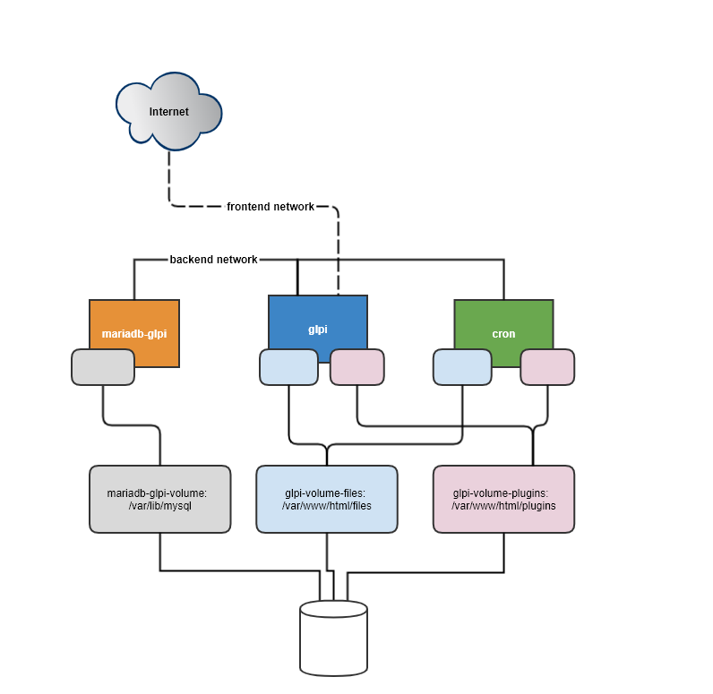

# GLPI Docker Container

GLPI é um gerenciador de ativos de TI e uma plataforma de gestão de tickets de incidentes e problemas de uma empresa.

### Executar após o compose up:
```bash
docker-compose exec glpi php /var/www/html/bin/console -n glpi:security:change_key
```


